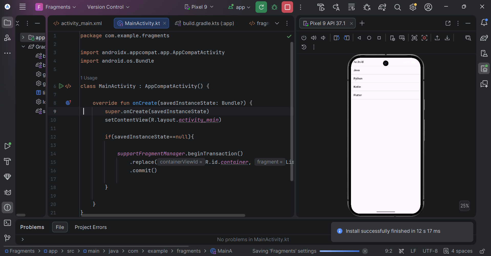
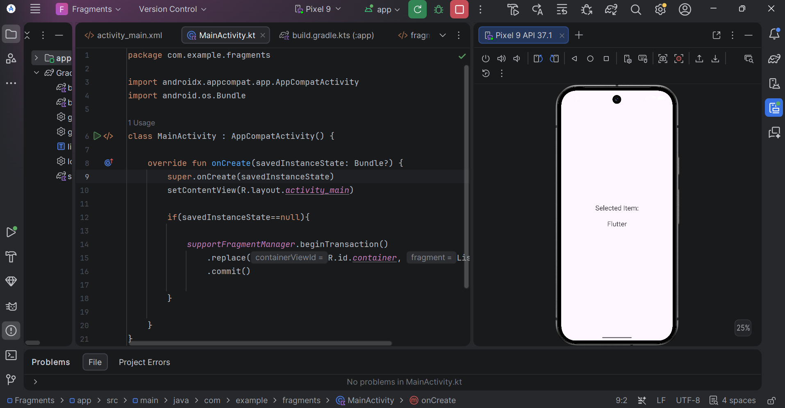

# 📱 Experiment 3: Build an Android Application using Fragments for Flexible UI

## 📌 Aim

To develop an Android application using **Fragments** that creates a flexible user interface. The application contains two Fragments:

- **List Fragment** – Displays a list of programming languages.
- **Detail Fragment** – Displays the details of the selected item.

The application demonstrates Fragment communication using **Bundle** and provides a flexible user interface.

---

## 🎯 Objective

To understand the concept of Android Fragments and implement a responsive user interface by displaying a list of items and showing the details of the selected item.

---

## 🛠 Software Requirements

| Software | Version |
|----------|---------|
| Android Studio | Latest Stable Version |
| Programming Language | Kotlin |
| Android SDK | API 24 or above |
| Device | Android Emulator / Physical Device |
| Operating System | Windows 10/11 |

---

## 📂 Project Structure

```text
Fragments/
│
├── app/
│   ├── src/
│   │   ├── main/
│   │   │   ├── java/
│   │   │   │   ├── MainActivity.kt
│   │   │   │   ├── ListFragment.kt
│   │   │   │   └── DetailFragment.kt
│   │   │   ├── res/
│   │   │   │   ├── layout/
│   │   │   │   ├── values/
│   │   │   │   └── drawable/
│   │   │   └── AndroidManifest.xml
│
├── screenshots/
│   ├── home_screen.png
│   └── detail_screen.png
│
└── README.md
```

---

## 📖 Concept

**Fragments** are reusable components of an Android Activity that help create flexible and responsive user interfaces.

### Working

```
Application Starts
        │
        ▼
List Fragment Displays Items
        │
        ▼
User Selects an Item
        │
        ▼
Detail Fragment Displays Selected Item
```

---

## ⚙️ Features

| Feature | Description |
|---------|-------------|
| 📋 List Fragment | Displays a list of programming languages |
| 📄 Detail Fragment | Displays the selected programming language |
| 🔄 Fragment Communication | Data passed using Bundle |
| 📱 Responsive UI | Fragment-based interface |
| 💻 Kotlin | Developed using Kotlin |

---

# 📸 Application Output

## 🏠 Home Screen

The application launches with the **List Fragment** displaying a list of programming languages.

<p align="center">
  
</p>

---

## 📄 Detail Screen

After selecting an item (**Flutter**), the **Detail Fragment** displays the selected item.

<p align="center">
  
</p>

---

# 🧪 Test Cases

| Test Case | Input | Expected Output | Actual Output |
|-----------|-------|-----------------|---------------|
| TC-01 | Launch the application | List Fragment displays programming languages | ✅ Successfully displayed |
| TC-02 | Select **Flutter** | Detail Fragment displays **Flutter** | ✅ Successfully displayed |

---

## 📚 Technologies Used

- Kotlin
- Android Studio
- Android SDK
- Android Fragments
- XML Layouts

---

## ✅ Result

The Android application was successfully developed using **Fragments**. The application displays a list of programming languages in the **List Fragment** and shows the selected item's details in the **Detail Fragment**. Fragment communication was successfully implemented using **Bundle**, providing a flexible and user-friendly interface.

---

## 👩‍💻 Developed By

| Name | Course | Subject |
|------|--------|---------|
| **Rashmi Kumari** | MCA | Mobile Application Development |

---
