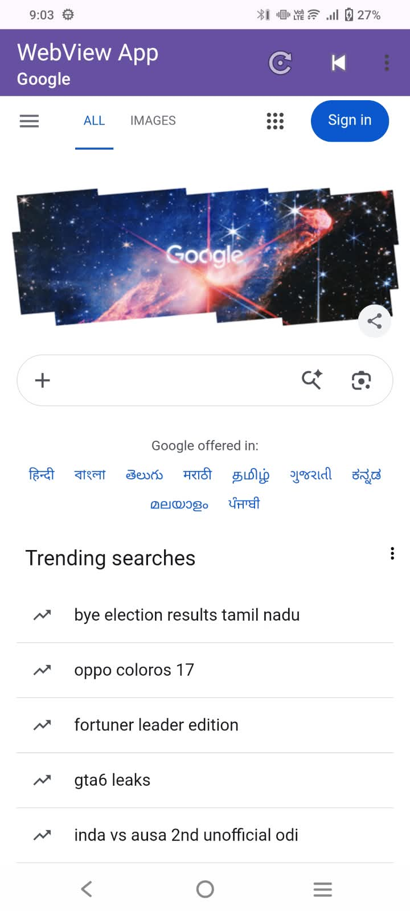
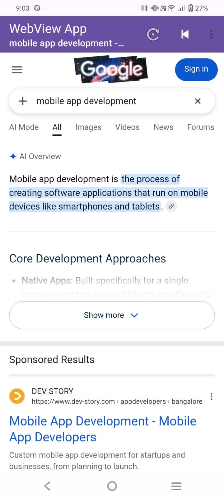
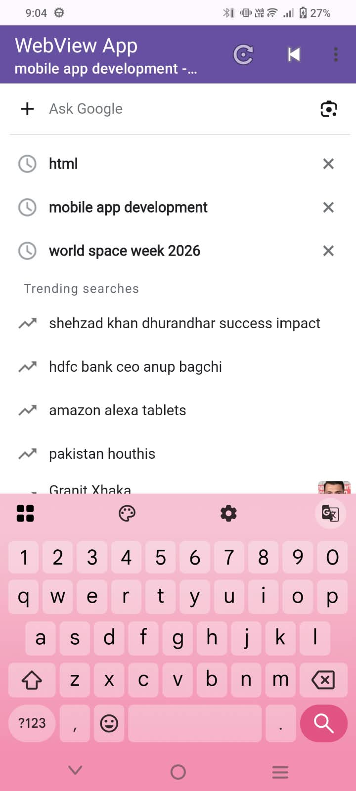
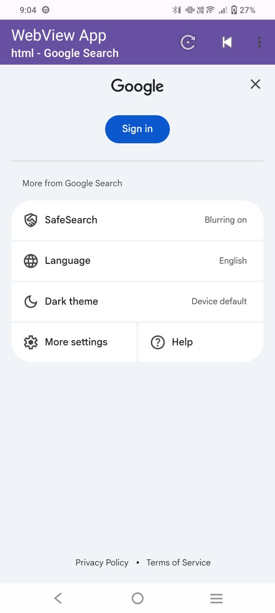
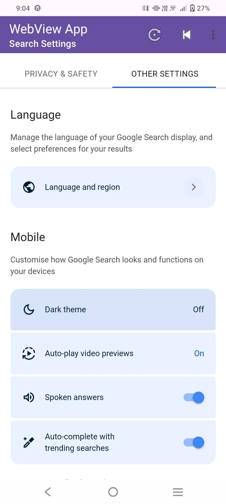

# Experiment – Implement Menus and WebView in an Android Application

## 📱 Web_View – Android Web Browser

### Student Details

| Field                    | Details                                               |
| ------------------------ | ----------------------------------------------------- |
| **Name**                 | Rashmi Kumari                                         |
| **USN**                  | 25MCAR0222                                            |
| **Programme**            | MCA                                                   |
| **Experiment**           | Implement Menus and WebView in an Android Application |
| **Platform**             | Android                                               |
| **Programming Language** | Kotlin                                                |
| **UI Technology**        | XML                                                   |
| **IDE**                  | Android Studio                                        |

---

## 🎯 Aim

To develop an Android application using WebView to display websites within the application and implement an Options Menu for website navigation, refreshing pages, and moving backward and forward through browsing history.

---

## Objectives

The objectives of this experiment are:

* To understand the implementation of WebView in Android.
* To load websites within an Android application.
* To implement an Options Menu using XML.
* To handle menu-item selections using Kotlin.
* To navigate between different websites.
* To implement refresh, back, and forward functionality.
* To display webpage loading progress.
* To update the toolbar subtitle with the webpage title or URL.
* To configure Internet permission in the Android manifest.
* To save and restore WebView state.

---

## 🧠 Technologies Used

### Kotlin

Kotlin is used to implement the application's logic, including WebView initialization, menu handling, webpage navigation, and loading progress.

### XML

XML is used to define the application's user interface, menu items, and manifest configuration.

### WebView

`WebView` is an Android component that displays web content directly inside an application.

In this project, Google is loaded when the application starts.

### WebViewClient

`WebViewClient` handles webpage navigation and loading events. It keeps website navigation inside the WebView.

### WebChromeClient

`WebChromeClient` tracks webpage loading progress and updates the toolbar subtitle with the webpage title when available.

### Options Menu

The Options Menu provides shortcuts to different websites and browser navigation controls.

---

## Application Features

1. **Website Loading:** Loads Google when the application starts.
2. **Website Navigation:** Opens Google, Wikipedia, GitHub, and YouTube.
3. **Refresh:** Reloads the current webpage.
4. **Back Navigation:** Returns to the previous webpage when browsing history is available.
5. **Forward Navigation:** Moves to the next webpage when forward history is available.
6. **Loading Progress:** Displays a progress indicator while a webpage loads.
7. **Toolbar Subtitle:** Displays the current URL or webpage title.
8. **System Back Handling:** Navigates backward through WebView history before using the normal activity Back behavior.
9. **State Preservation:** Saves and restores WebView state during activity recreation.

---

## 📂 Project Structure

```text
Web_View/
│
├── app/
│   └── src/
│       └── main/
│           ├── java/
│           │   └── com/
│           │       └── example/
│           │           └── web_view/
│           │               └── MainActivity.kt
│           │
│           ├── res/
│           │   ├── layout/
│           │   │   └── activity_main.xml
│           │   ├── menu/
│           │   │   └── main_menu.xml
│           │   ├── values/
│           │   └── xml/
│           │
│           └── AndroidManifest.xml
│
├── screenshots/
│   ├── webview-home.png
│   ├── test-case-1-load-website.png
│   ├── test-case-2-search-results.png
│   ├── test-case-3-settings.png
│   ├── search-suggestions.png
│   ├── settings-menu.png
│   ├── settings-privacy-safety.png
│   └── settings-other-options.png
│
└── README.md
```

The structure shows the main files relevant to the experiment. Additional project files may be present.

---

## ⚙️ MainActivity.kt

`MainActivity.kt` contains the main application logic.

### WebView Configuration

The WebView is configured with JavaScript, DOM storage, overview mode, and wide-viewport support.

```kotlin
webView.settings.apply {
    javaScriptEnabled = true
    domStorageEnabled = true
    loadWithOverviewMode = true
    useWideViewPort = true
}
```

### Initial Website Loading

Google is loaded when the activity starts and no saved activity state is being restored.

```kotlin
if (savedInstanceState == null) {
    webView.loadUrl("https://www.google.com")
}
```

### Options Menu Implementation

The Options Menu is loaded from `res/menu/main_menu.xml`.

```kotlin
override fun onCreateOptionsMenu(menu: Menu?): Boolean {
    menuInflater.inflate(R.menu.main_menu, menu)
    return true
}
```

The menu-item selections are handled using `onOptionsItemSelected()`.

| Menu Item | Action                            |
| --------- | --------------------------------- |
| Google    | Opens `https://www.google.com`    |
| Wikipedia | Opens `https://www.wikipedia.org` |
| GitHub    | Opens `https://github.com`        |
| YouTube   | Opens `https://www.youtube.com`   |
| Refresh   | Reloads the current webpage       |
| Back      | Navigates backward when possible  |
| Forward   | Navigates forward when possible   |

### Loading Progress

The `LinearProgressIndicator` displays webpage loading progress. `WebChromeClient` updates the progress value and hides the indicator when loading reaches completion.

### Back Navigation

The application checks `webView.canGoBack()` before navigating to the previous webpage. The system Back button uses the same browsing-history approach before allowing normal activity Back behavior.

### Saving and Restoring State

The application uses `webView.saveState()` and `webView.restoreState()` to preserve and restore browsing state.

---

## AndroidManifest.xml

The manifest declares the permissions and configuration required by the application.

### Internet Permission

```xml
<uses-permission android:name="android.permission.INTERNET" />
```

This permission allows the application to access the internet and load online websites.

### Main Activity Configuration

```xml
<activity
    android:name=".MainActivity"
    android:exported="true"
    android:windowSoftInputMode="adjustResize">

    <intent-filter>
        <action android:name="android.intent.action.MAIN" />
        <category android:name="android.intent.category.LAUNCHER" />
    </intent-filter>

</activity>
```

The main activity is configured as the launcher activity so that the application can be started from the device's app launcher.

Other manifest configurations include the application theme, launcher icons, backup settings, data-extraction rules, and right-to-left layout support.

An active internet connection is required to load online websites.

---

## Application Workflow

1. The user launches the application.
2. `MainActivity` initializes the toolbar, WebView, and progress indicator.
3. Google loads inside the WebView if no saved activity state is being restored.
4. The progress indicator displays loading progress.
5. The toolbar subtitle updates with the webpage URL or title.
6. The user opens the Options Menu.
7. The user selects a website or navigation action.
8. The WebView loads the selected website, refreshes the page, or navigates through browsing history.
9. The system Back button navigates backward when WebView history is available.

---

## How to Run the Project

### Step 1 – Open the Project

1. Open Android Studio.
2. Select **Open**.
3. Choose the `Web_View` project folder.
4. Allow Gradle synchronization to finish.

### Step 2 – Select a Device

Start an Android emulator or connect a physical Android device.

### Step 3 – Run the Application

Click the **Run** button in Android Studio.

### Step 4 – Test the Application

Verify that Google loads inside the WebView. Open the Options Menu and test the website navigation, refresh, back, and forward actions.

Ensure the device has an active internet connection.

---

## 🧪 Test Cases

| Test Case | Action                                        | Expected Result                                          |
| --------- | --------------------------------------------- | -------------------------------------------------------- |
| TC01      | Launch the application                        | Google loads inside the WebView                          |
| TC02      | Select Wikipedia from the Options Menu        | Wikipedia loads inside the WebView                       |
| TC03      | Select GitHub or YouTube                      | The selected website loads                               |
| TC04      | Select Refresh                                | The current webpage reloads                              |
| TC05      | Select Back when browsing history exists      | The previous webpage is displayed                        |
| TC06      | Select Forward when forward history exists    | The next webpage is displayed                            |
| TC07      | Observe the progress indicator during loading | Progress is displayed and hidden after loading completes |
| TC08      | Press the Android system Back button          | WebView navigates backward when history is available     |

Test each case on the emulator or physical device and record the actual results.

---

## 📸 Screenshots

Add your application screenshots to the `screenshots/` folder in the GitHub repository.

### WebView Home Page


### Website Loading


### Search Results


### Website Settings


### Privacy and Safety Settings


### Other Settings


The screenshot filenames must match the files uploaded to GitHub. These screenshots document the supplied Google pages and settings; add separate screenshots if you want to demonstrate the application's Options Menu and other websites.

---

## Advantages

* Displays websites inside the application.
* Provides simple website navigation.
* Supports page refresh and browsing history.
* Displays webpage loading progress.
* Keeps navigation within the WebView.
* Uses Kotlin and XML for Android development.

---

## Limitations

* Online websites require an active internet connection.
* Website content and behavior depend on the external websites.
* The application provides basic browsing functionality rather than a complete browser.

---

## ✅ Result and Conclusion

The `Web_View` Android application demonstrates how to display websites using WebView and implement an Options Menu with website navigation, refresh, back, and forward functionality.

The experiment also covers webpage loading progress, toolbar subtitle updates, Internet permission configuration, and WebView state preservation.

Through this experiment, the concepts of WebView, menu handling, Kotlin programming, XML resources, and Android activity configuration are demonstrated.

---

**Developed By:** Rashmi Kumari
**USN:** 25MCAR0222
**Programme:** MCA

